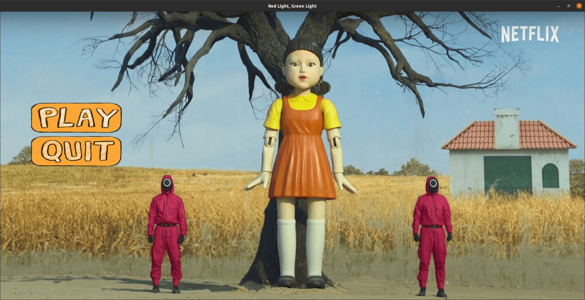

# Red-Light-Green-Light-Squid-Game
A game developed after a game in the famous Squid Game movie called "Red light, Green light", using Mediapipe framework for movement detection and PyQT5 as GUI (Graphical User Interface). Have fun!  
  
(Click in the image below for a demo clip)
  

### Install required Python libraries & packages
`pip install -r requirements.txt`
### Start the game
`python main.py`  
  
*Note: Currently the game is only supported for 1 player only*
